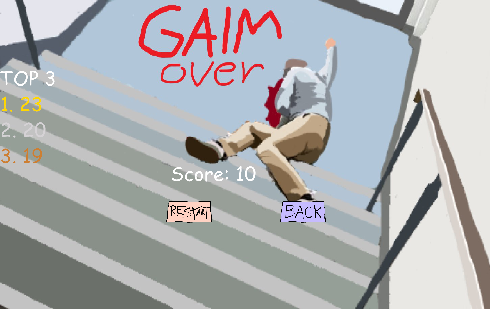

# 🪁 Epic Jumprope Game

**Epic Jumprope Game** is a fun and fast-paced game where players jump over a rope and try to keep going as long as possible. It features power-ups (both good and bad) that can alter the game mechanics and challenge your reflexes.

---

## 🎮 Gameplay

The goal of **Epic Jumprope Game** is simple: **jump over the rope** as many times as you can. The game gets faster over time, so you’ll need quick reflexes to keep up!

### Power-ups:

- **Shield**: Protects you from one hit.
- **Speed Boost**: Makes the game speed up for a challenge.
- **Slow Motion**: Slows down the game for a short period to make it potentially easier
- **Double Jump**: Allows you to jump twice in one go allowing for strategic plays
- **Flashbang**: A power-up that flashes your screen white, making it impossible to see!

### Multiplayer Mode:

- Play **locally with a friend** on the same keyboard! Compete for the highest score and see who can jump the most without getting hit.

---

## 🛠 Tech Stack

- **Game Engine**: Unity
- **Language**: C#
- **Platform**: PC (Windows)

---

## 📌 Project Info

- Built in a summer game development camp as part of a small group project
- The goal was to create a fun, simple, and addictive game for players to enjoy locally with friends
- Designed with quick gameplay, increasing difficulty, and exciting power-ups

---

## 📸 Screenshots

  
  
  
  

